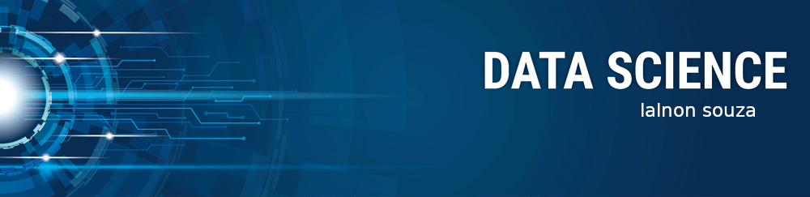

# data_science

   

  

# Lalnon Souza
Firefighter and data science enthusiast

As a Military Firefighter I developed characteristics such as quick thinking, discipline, ability to work in a team and under pressure that I use in the study and application of Data Science and Machine Learning.

**Background in:** Python, Machine Learning.

**Links:**
* [LinkedIn](https://www.linkedin.com/in/lalnonsouza)
* [Medium](https://www.medium.com)

## Projetos:
Veja os tutoriais publicados do Sigmoidal:

* **Desafio 1 do DSNP 3.0:** https://bit.ly/2L2cMwy
* **Desafio do Titanic:** https://bit.ly/2Li5pzY

---

